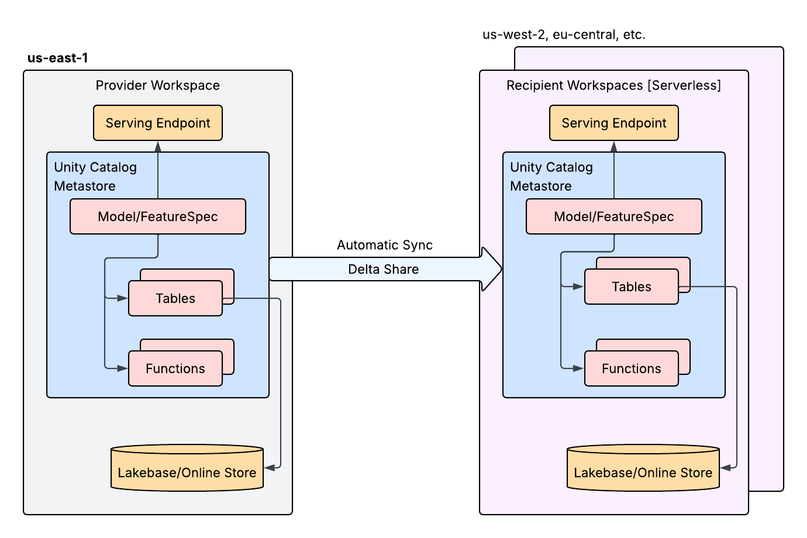

# Multi-region model serving on Databricks

```
Extend a single-region Databricks model serving stack to additional regions using serverless
workspaces, Delta Sharing, Model Serving, and Lakebase. One region owns the source of truth
(the offline feature table in Delta and the model registered in Unity Catalog); every other
region reads those assets through Delta Sharing and serves predictions in-region from a local
Lakebase online store. You train once and share, with no data copies and no retraining.
```

This repository is the companion code for the blog post on multi-region model serving. It walks
through building a single-region fraud-detection serving stack, then extending it to a second
region for low-latency, in-region inference.

**Companion blog post:** _link to be added once published._

## Architecture



At a high level, one region acts as the **provider** and every additional region is a **recipient**:

- The **provider** region owns the source of truth: the offline feature table in Delta and the
  model registered in Unity Catalog.
- **Delta Sharing** exposes both assets to recipient regions through secure, scoped credentials.
- Each **recipient** region builds a thin, in-region serving stack on top of the share: a Lakebase
  online store synced from the shared feature table, and a Model Serving endpoint that serves the
  shared model.

Because each region runs a complete, independent serving stack, inference and feature lookups stay
in-region and close to the user, and a regional outage becomes a routing change rather than a full
outage.

## Repository layout

| Path | Description |
|------|-------------|
| `notebooks/_config.py` | Shared configuration. Edit the names here once, then import this repo into both workspaces. |
| `notebooks/01_provider_single_region.py` | Provider (Workspace A): offline feature table, Lakebase instance, synced table, model training + UC registration, serving endpoint. |
| `notebooks/02_delta_sharing.py` | Delta Sharing across the two metastores. Provider cells create and grant the share; recipient cells mount it as a catalog. |
| `notebooks/03_recipient_serving.py` | Recipient (Workspace B): in-region Lakebase instance, synced table sourced from the share, serving endpoint on the shared model. |
| `terraform/` | Provisions the serverless recipient workspace and its Unity Catalog metastore (account-level). |
| `docs/architecture.png` | Architecture diagram. |

## Prerequisites

- Databricks workspaces with Unity Catalog enabled in each region you plan to serve from.
- Delta Sharing enabled on your account (Databricks-to-Databricks).
- Account admin able to create additional workspaces and metastores.
- Metastore admin in both the provider and recipient regions (required to create and mount shares,
  including `CREATE SHARE` and `CREATE RECIPIENT`).
- Terraform with the Databricks provider for provisioning the second workspace.
- A recent `databricks-sdk` for the Lakebase and Model Serving calls. The notebooks upgrade to the
  latest SDK at runtime with `%pip install --upgrade databricks-sdk` (validated on 0.137.0).

## Data

No datasets are shipped in this repository. The provider notebook generates a small synthetic
account-level fraud feature table in-notebook (`spark.range` plus randomized columns), so there is
no PII and nothing to download.

## How to run

1. **Configure.** Edit `notebooks/_config.py` with your catalog, schema, and resource names. After
   the recipient workspace exists, fill `RECIPIENT_SHARING_IDENTIFIER` with the new metastore's
   global sharing identifier.
2. **Provision the recipient region (Terraform).** From `terraform/`, copy
   `terraform.tfvars.example` to `terraform.tfvars`, fill in your account values, then
   `terraform init && terraform apply`. This creates the serverless workspace and Metastore B.
3. **Provider stack.** Import this repo into the provider workspace and run
   `01_provider_single_region.py` (Run all).
4. **Delta Sharing.** Run the provider cells of `02_delta_sharing.py` in the provider workspace,
   then the recipient cells in the recipient workspace. This notebook intentionally spans two
   workspaces and is not a single "Run all".
5. **Recipient serving.** Import this repo into the recipient workspace and run
   `03_recipient_serving.py` (Run all).

To add a third or fourth region, repeat steps 2 through 5 for the new region.

## Teardown

Each notebook has an optional cleanup cell at the end (commented out) that tears down what it
created, in dependency order. Uncomment and run them, then `terraform destroy` from `terraform/`
to remove the recipient workspace and metastore.

## Validation

The provider stack (feature table, HA Lakebase instance, continuous synced table, model
registration, and the serving endpoint) and the Delta Sharing SQL were validated against real
workspaces on `databricks-sdk` 0.137.0.

## Video Overview

_To be added._

## How to get help

Databricks support doesn't cover this content. For questions or bugs, please open a GitHub issue
and the team will help on a best effort basis.

## License

&copy; 2025 Databricks, Inc. All rights reserved. The source in this notebook is provided subject to the Databricks License [https://databricks.com/db-license-source].  All included or referenced third party libraries are subject to the licenses set forth below.

| library | description | license | source |
|---------|-------------|---------|--------|
| Databricks SDK for Python | Lakebase, synced tables, and Model Serving calls | Apache-2.0 | https://github.com/databricks/databricks-sdk-py |
| MLflow | Model logging and Unity Catalog registration | Apache-2.0 | https://github.com/mlflow/mlflow |
| scikit-learn | Gradient-boosted fraud classifier | BSD-3-Clause | https://github.com/scikit-learn/scikit-learn |
| pandas | Feature dataframe handling | BSD-3-Clause | https://github.com/pandas-dev/pandas |
| Apache Spark (PySpark) | Feature table build and synthetic data generation | Apache-2.0 | https://github.com/apache/spark |
| Terraform Databricks provider | Provision serverless workspace and metastore | Apache-2.0 | https://github.com/databricks/terraform-provider-databricks |
